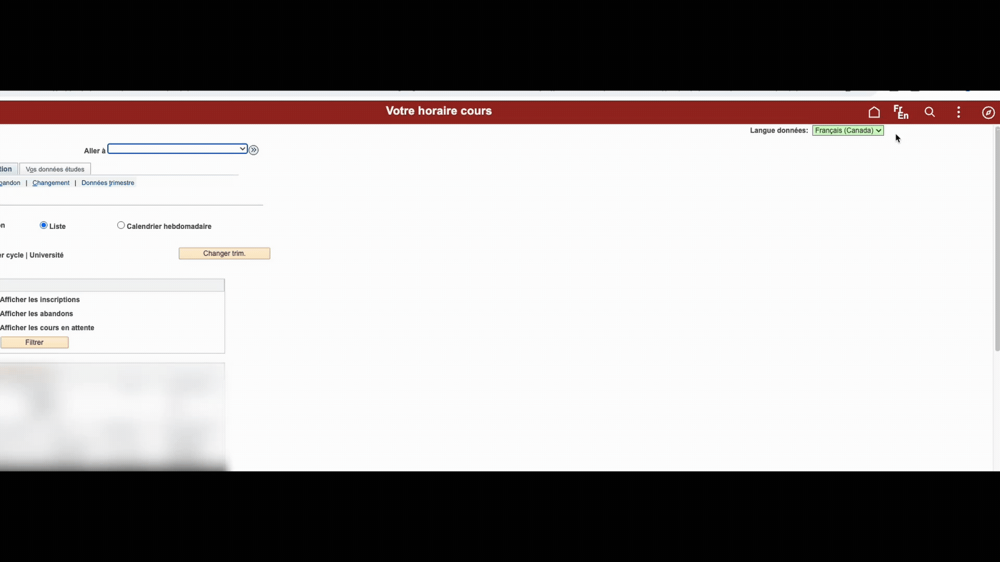
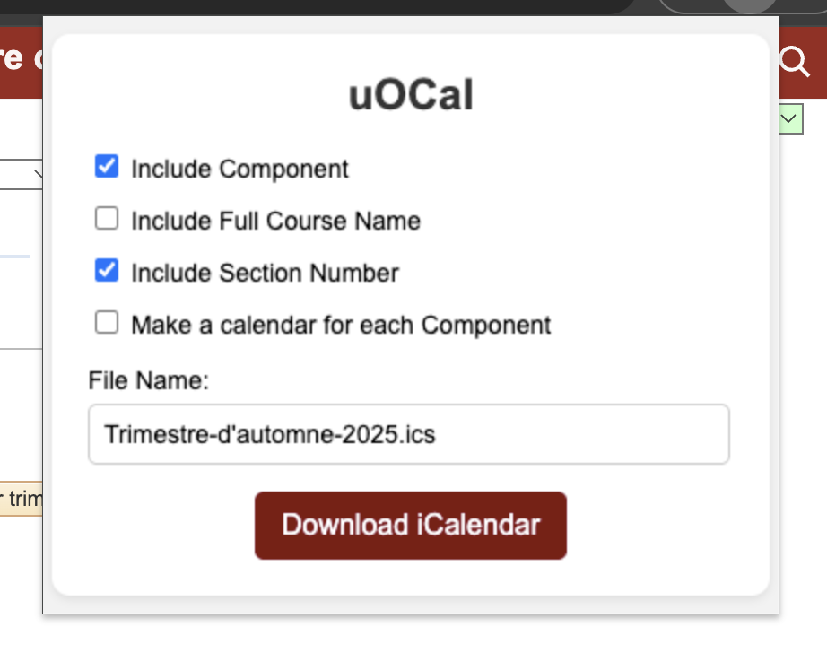
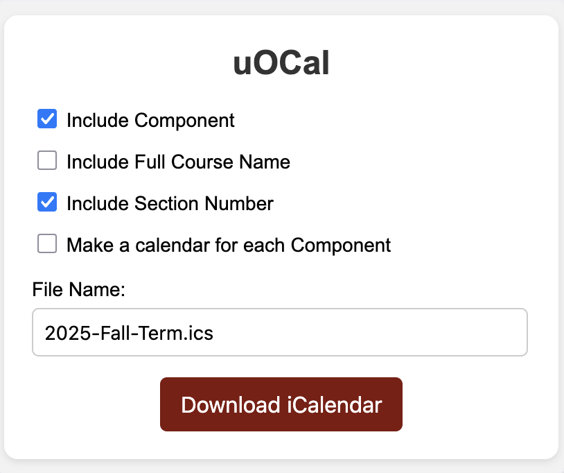
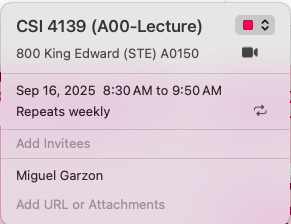
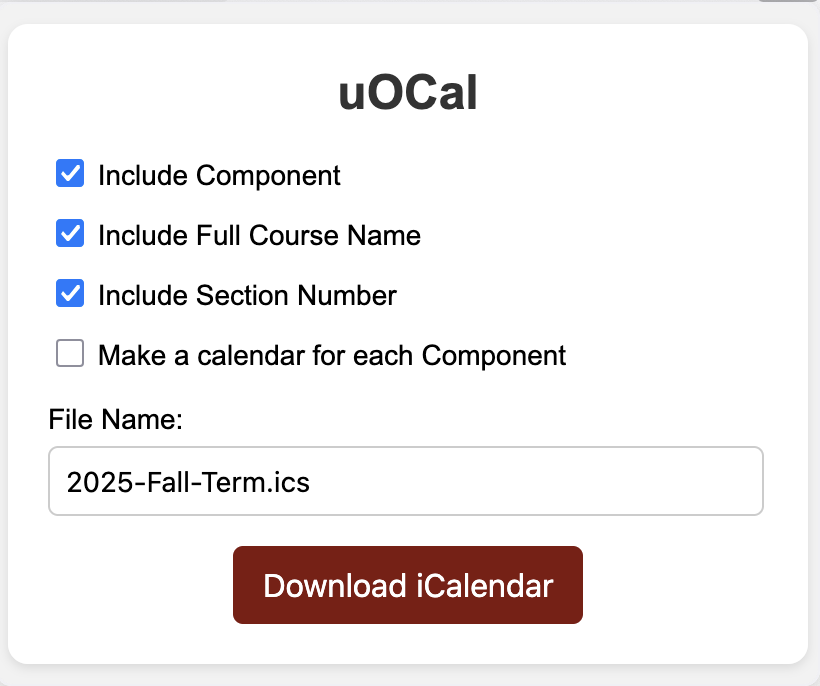
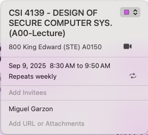
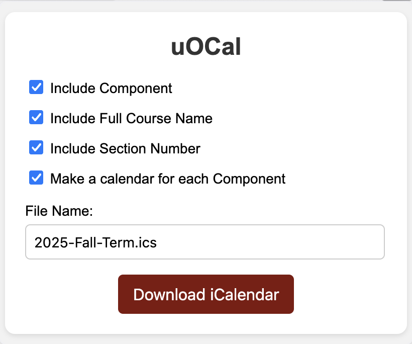
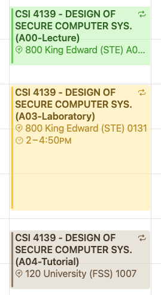

# uOCal 
uOCal is a web extension that parses you uOZone schedule and generates an iCal (ics) file. It is useful if you want to easily import your class schedule to your calendar app.

> [!NOTE]  
> All processing happens in your browser. Your data never leaves your device.

## Features
- Parses all your classes (including Lectures, Labs, Tutorials, DGDs etc...)
  - Automatically excludes non-classes like COP100 or FLS3500
- Includes Address & Room Number and Class Section (See [Options](#options))
- Works with both English and French version of uOZone
- Private by design: all computation happens locally, with no servers or third-party processing involved
- Free and open-source

Below is a capture of the extension in action:
<p align="center">
  
</p>


> [!NOTE]
> For privacy reasons, in the capture above:
> - Course codes and class names are obfuscated (e.g. `CXX 4XXX` instead of the actual course code).
> - Locations/addresses are also partially obfuscated for privacy.
> - Class time has also been shifted
> 
>In a real schedule import, you’ll see the full course names and locations exactly as they appear in the university portal. (See [Options](#options))

<p align="center">
  
</p>


## Table of Content
- [Installation](#installation)  
    - [Firefox](#firefox)
    - [Chrome](#chromeedge)
- [Options](#options)
- [Build and Development](#build-and-development)  
- [Bugs](#bugs)

## Installation

### Firefox

1. Clone or download this repository to your local machine.
2. Open Firefox and go to `about:debugging`.
3. Click on **This Firefox** in the sidebar.
4. Click **Load Temporary Add-on...** and select the `manifest.json` file in the folder containing this extension.

### Chrome/Edge

1. Clone or download this repository to your local machine.
2. Open Chrome or Edge and go to `chrome://extensions/`.
3. Enable **Developer mode** in the top right corner.
4. Click **Load unpacked** and select the folder containing this extension.

## Options
You use these options to further customize your schedule.

- Include Component (Lecture, Lab, Tutorial) _(Enabled by default)_
- Include Section Number (e.g A00) _(Enabled by default)_

<p align="center">
  
  
</p>

- Include Full Course Name
<p align="center">
  
  
</p>

- Make a calendar for each Component

  You can have a calendar for each component. For example, you get a separate calendar for your lectures, labs, tutorials etc...
  You should use this, if you want each component to have a different color in your schedule.

<p align="center">
  
  
</p>


### 

## Build and Development
The latest version is already built and included in the `dist/` directory.

If you'd like to build it yourself or contribute to the development and maintenance, check out the section below.

> [!TIP]
> If you only want to use the extension, the [Options](#options) and [Installation](#installation) sections are all that you need.

### Prerequisites
- Node.js
- npm (which already comes with Node)

### Get Started
This will install all the necessary dependencies.
```
npm install
```

### To build (bundle)
```
npm run build
```

You are good to go! Everytime you make changes to the code, do not forget to build it.

# Bugs
If you find a bug or the extension crashes, please raise an issue. Do not forget to include the logs, otherwise I won't be able to reproduce the bug.

If you have the time and skills to fix it yourself, please do! All contributions are welcomed. You can then open a PR.
